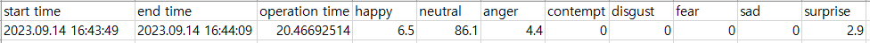

# 감정 인식 + Tracking

이 저장소는 [YOLOv5](https://github.com/ultralytics/yolov5)와 [RepVGG](https://github.com/DingXiaoH/RepVGG)를 기반으로 하여 작성한 [감정 인식](https://github.com/George-Ogden/emotion)과 [Tracking](https://github.com/mikel-brostrom/yolo_tracking)을 연동하여 감정 인식할 사람을 추적함과 동시에 현재 감정을 표출하는 소스 코드이다.
기존에 작성했던 프로그램에서 감정 인식 중 **사람 인식이 끊길 경우** 현재까지 저장되던 감정 비율이 **초기화**되는 문제를 해결하기 위해 **Tracking**을 적용하였다.


## 초기 설정 및 설치

Python Version: **3.8.11**

CUDA Version: **11.1**

cuDNN Version: **8.7.0**

1. [yolov5-crowdhuman](https://github.com/deepakcrk/yolov5-crowdhuman) 저장소의 [모델](https://drive.google.com/file/d/1gglIwqxaH2iTvy6lZlXuAcMpd_U0GCUb/view)을 다운로드.
2. [YOLOv5](https://github.com/ultralytics/yolov5) 저장소를 **yolov5** 폴더에 `clone`하기.
3. 사용 라이브러리 설치: `pip install -r requirements.txt`
4. PyTorch 설치: `pip install torch==1.9.0+cu111 torchvision==0.10.0+cu111 torchaudio==0.9.0 -f https://download.pytorch.org/whl/torch_stable.html`


## 실행 방법

```bash
> usage: track_v5.py [-h] [--yolo-weights YOLO_WEIGHTS [YOLO_WEIGHTS ...]]
                   [--strong-sort-weights STRONG_SORT_WEIGHTS]
                   [--config-strongsort CONFIG_STRONGSORT] [--source SOURCE]
                   [--imgsz IMGSZ [IMGSZ ...]] [--conf-thres CONF_THRES]
                   [--iou-thres IOU_THRES] [--max-det MAX_DET]
                   [--device DEVICE] [--show-vid] [--save-txt] [--save-conf]
                   [--save-crop] [--save-vid] [--nosave] [--count] [--draw]
                   [--c  lasses CLASSES [CLASSES ...]] [--agnostic-nms]
                   [--augment] [--visualize] [--update] [--project PROJECT]
                   [--save-csv] [--name NAME] [--exist-ok]
                   [--line-thickness LINE_THICKNESS] [--hide-labels]
                   [--hide-conf] [--hide-class] [--half] [--dnn]

optional arguments:
  -h, --help            show this help message and exit
  --yolo-weights YOLO_WEIGHTS [YOLO_WEIGHTS ...]
                        model.pt path(s)
  --strong-sort-weights STRONG_SORT_WEIGHTS
  --config-strongsort CONFIG_STRONGSORT
  --source SOURCE       file/dir/URL/glob, 0 for webcam
  --imgsz IMGSZ [IMGSZ ...], --img IMGSZ [IMGSZ ...], --img-size IMGSZ [IMGSZ ...]
                        inference size h,w
  --conf-thres CONF_THRES
                        confidence threshold
  --iou-thres IOU_THRES
                        NMS IoU threshold
  --max-det MAX_DET     maximum detections per image
  --device DEVICE       cuda device, i.e. 0 or 0,1,2,3 or cpu
  --show-vid            display tracking video results
  --save-txt            save results to *.txt
  --save-conf           save confidences in --save-txt labels
  --save-crop           save cropped prediction boxes
  --save-vid            save video tracking results
  --nosave              do not save images/videos
  --count               display all MOT counts results on screen
  --draw                display object trajectory lines
  --classes CLASSES [CLASSES ...]
                        filter by class: --classes 0, or --classes 0 2 3
  --agnostic-nms        class-agnostic NMS
  --augment             augmented inference
  --visualize           visualize features
  --update              update all models
  --project PROJECT     save results to project/name
  --save-csv            save detected emotion results to project/csv
  --name NAME           save results to project/name
  --exist-ok            existing project/name ok, do not increment
  --line-thickness LINE_THICKNESS
                        bounding box thickness (pixels)
  --hide-labels         hide labels
  --hide-conf           hide confidences
  --hide-class          hide IDs
  --half                use FP16 half-precision inference
  --dnn                 use OpenCV DNN for ONNX inference
```


```bash
> python track_5v.py --yolo-weights [YOLO PT FILE] --source [RTSP]
```


## 감정 인식

8개 범주의 감정 인식이 가능하며 인식된 감정 비율을 화면에 표출한다.
인식 가능한 얼굴 표정:

- anger: 분노
- contempt: 경멸
- disgust: 혐오
- fear: 공포
- happy: 행복
- neutral: 보통
- sad: 슬픔
- surprise: 놀람


<details>
    <summary>만약 ImportError가 발생한다면</summary>

scale_coords, clip_coords 함수를 yolov5/utils/general.py에 추가한다.

- **scale_coords**

```python
def scale_coords(img1_shape, coords, img0_shape, ratio_pad=None):
    # Rescale coords (xyxy) from img1_shape to img0_shape
    if ratio_pad is None:  # calculate from img0_shape
        gain = min(img1_shape[0] / img0_shape[0], img1_shape[1] / img0_shape[1])  # gain  = old / new
        pad = (img1_shape[1] - img0_shape[1] * gain) / 2, (img1_shape[0] - img0_shape[0] * gain) / 2  # wh padding
    else:
        gain = ratio_pad[0][0]
        pad = ratio_pad[1]

    coords[:, [0, 2]] -= pad[0]  # x padding
    coords[:, [1, 3]] -= pad[1]  # y padding
    coords[:, :4] /= gain
    clip_coords(coords, img0_shape)
    return coords
```

- **clip_coords**

```python
def clip_coords(boxes, img_shape):
    # Clip bounding xyxy bounding boxes to image shape (height, width)
    boxes[:, 0].clamp_(0, img_shape[1])  # x1
    boxes[:, 1].clamp_(0, img_shape[0])  # y1
    boxes[:, 2].clamp_(0, img_shape[1])  # x2
    boxes[:, 3].clamp_(0, img_shape[0])  # y2
```

</details>


## 저장 데이터 형식



`--save-csv` 사용 시 감정 인식 데이터 저장을 시작함.

- start time: 인식이 시작되는 시간
- end time: 인식이 끝난 시간
- operation time: 감정 인식 동작 시간
- 8가지 감정 분류: 감정 분포 비율
